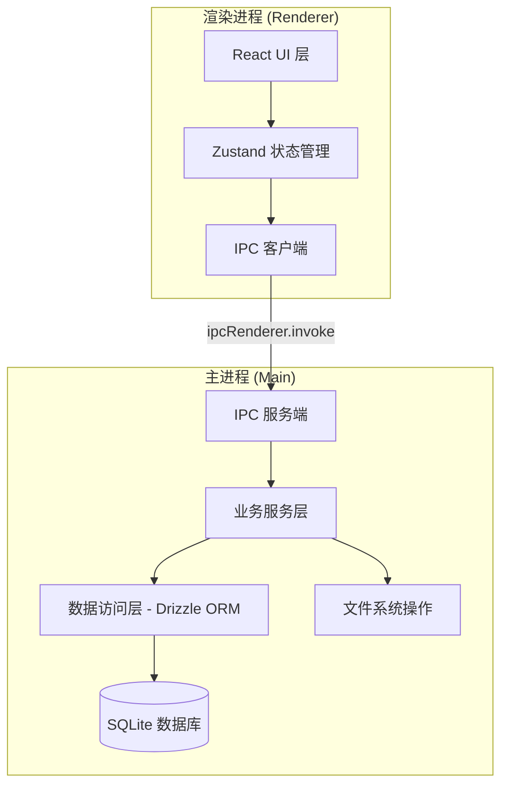
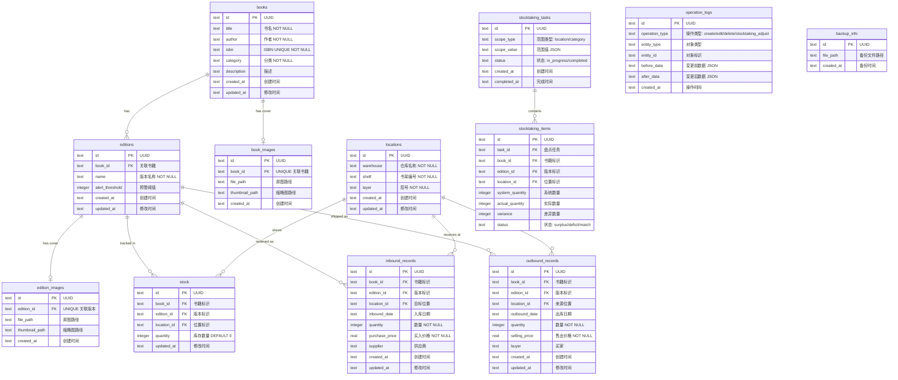
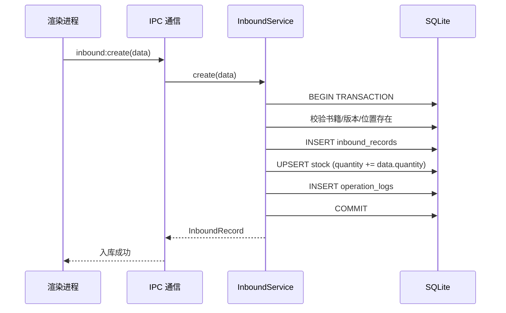
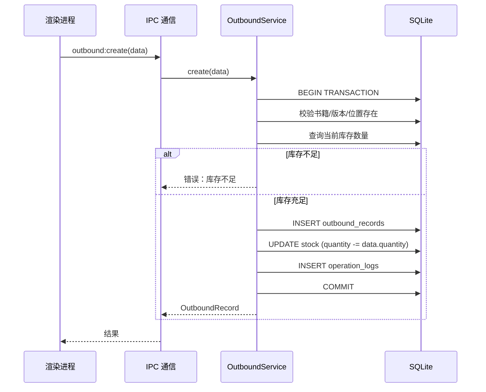
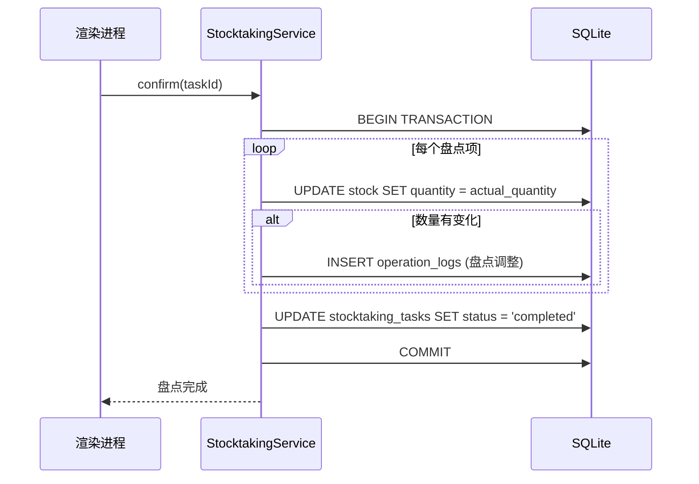

# 技术设计文档：书籍管理系统

## 概述

书籍管理系统是一个本地桌面应用，用于管理书籍库存的位置、入库出库流转记录和财务信息。系统采用 Electron + React 前端 + SQLite 本地数据库的技术栈，所有数据在本地持久化存储，无需网络连接即可使用。

### 技术选型

| 层级 | 技术 | 理由 |
|------|------|------|
| 前端框架 | React 18 + TypeScript | 组件化开发，类型安全，生态成熟 |
| 桌面运行时 | Electron | 跨平台桌面应用，支持本地文件系统访问 |
| UI 组件库 | Ant Design 5 | 企业级组件库，表格、表单、图表组件丰富 |
| 本地数据库 | SQLite (better-sqlite3) | 轻量级嵌入式数据库，无需安装服务，同步 API 性能好 |
| ORM | Drizzle ORM | 类型安全的 SQL 查询构建器，轻量且与 SQLite 兼容性好 |
| 状态管理 | Zustand | 轻量级状态管理，API 简洁 |
| 文件导入导出 | xlsx (SheetJS) | 支持 Excel 和 CSV 的读写 |
| 图片处理 | sharp | 生成缩略图，图片格式校验 |
| 构建工具 | Vite + electron-builder | 快速开发构建，Electron 打包 |
| 测试框架 | Vitest + fast-check | 单元测试 + 属性测试 |

### 核心设计原则

1. **离线优先**：所有数据本地存储，不依赖网络
2. **数据一致性**：入库/出库操作与库存数量变更在同一事务中完成
3. **可追溯性**：所有数据变更自动记录操作日志
4. **防误操作**：删除操作需确认，关联数据存在时禁止删除

## 架构

### 整体架构

系统采用 Electron 的主进程/渲染进程分离架构：



### 进程职责

- **主进程**：数据库操作、文件系统访问（图片存储、备份恢复、导入导出）、业务逻辑
- **渲染进程**：UI 渲染、用户交互、状态管理、通过 IPC 调用主进程服务

### 目录结构

```
src/
├── main/                          # Electron 主进程
│   ├── index.ts                   # 主进程入口
│   ├── ipc/                       # IPC 处理器注册
│   │   ├── book.ipc.ts
│   │   ├── edition.ipc.ts
│   │   ├── location.ipc.ts
│   │   ├── inbound.ipc.ts
│   │   ├── outbound.ipc.ts
│   │   ├── stock.ipc.ts
│   │   ├── dashboard.ipc.ts
│   │   ├── stocktaking.ipc.ts
│   │   ├── backup.ipc.ts
│   │   ├── export.ipc.ts
│   │   ├── import.ipc.ts
│   │   ├── log.ipc.ts
│   │   └── image.ipc.ts
│   ├── services/                  # 业务服务层
│   │   ├── book.service.ts
│   │   ├── edition.service.ts
│   │   ├── location.service.ts
│   │   ├── inbound.service.ts
│   │   ├── outbound.service.ts
│   │   ├── stock.service.ts
│   │   ├── price.service.ts
│   │   ├── profit.service.ts
│   │   ├── dashboard.service.ts
│   │   ├── alert.service.ts
│   │   ├── stocktaking.service.ts
│   │   ├── backup.service.ts
│   │   ├── export.service.ts
│   │   ├── import.service.ts
│   │   ├── log.service.ts
│   │   └── image.service.ts
│   └── db/                        # 数据库层
│       ├── index.ts               # 数据库初始化
│       ├── schema.ts              # Drizzle 表定义
│       └── migrations/            # 数据库迁移
├── renderer/                      # React 渲染进程
│   ├── App.tsx
│   ├── main.tsx
│   ├── pages/                     # 页面组件
│   │   ├── Dashboard.tsx
│   │   ├── BookList.tsx
│   │   ├── BookDetail.tsx
│   │   ├── LocationList.tsx
│   │   ├── InboundList.tsx
│   │   ├── OutboundList.tsx
│   │   ├── StockList.tsx
│   │   ├── PriceHistory.tsx
│   │   ├── ProfitReport.tsx
│   │   ├── AlertList.tsx
│   │   ├── StocktakingList.tsx
│   │   ├── StocktakingDetail.tsx
│   │   ├── LogList.tsx
│   │   ├── BackupRestore.tsx
│   │   ├── ImportBooks.tsx
│   │   └── ExportData.tsx
│   ├── components/                # 通用组件
│   │   ├── Layout.tsx
│   │   ├── Sidebar.tsx
│   │   ├── BookForm.tsx
│   │   ├── EditionForm.tsx
│   │   ├── LocationForm.tsx
│   │   ├── InboundForm.tsx
│   │   ├── OutboundForm.tsx
│   │   ├── BatchInboundForm.tsx
│   │   ├── BatchOutboundForm.tsx
│   │   ├── ImageUpload.tsx
│   │   └── ConfirmDialog.tsx
│   ├── stores/                    # Zustand 状态
│   │   ├── bookStore.ts
│   │   ├── locationStore.ts
│   │   ├── stockStore.ts
│   │   └── dashboardStore.ts
│   └── utils/                     # 工具函数
│       ├── ipc.ts                 # IPC 调用封装
│       ├── format.ts              # 格式化工具
│       └── validation.ts          # 前端校验
├── shared/                        # 主进程和渲染进程共享
│   ├── types.ts                   # 类型定义
│   ├── constants.ts               # 常量
│   └── ipc-channels.ts            # IPC 通道名称
└── tests/                         # 测试
    ├── unit/                      # 单元测试
    ├── property/                  # 属性测试
    └── helpers/                   # 测试辅助
```

## 组件与接口

### IPC 通信接口

渲染进程通过 `ipcRenderer.invoke` 调用主进程服务，主进程通过 `ipcMain.handle` 注册处理器。所有 IPC 通道名称在 `shared/ipc-channels.ts` 中统一定义。

#### 书籍管理接口

```typescript
// IPC 通道
'book:create'    -> (data: CreateBookInput) => Book
'book:update'    -> (id: string, data: UpdateBookInput) => Book
'book:delete'    -> (id: string) => void
'book:getById'   -> (id: string) => BookWithEditions
'book:search'    -> (query: SearchBookQuery) => Book[]
'book:list'      -> (pagination: PaginationInput) => PaginatedResult<Book>

'edition:create' -> (data: CreateEditionInput) => Edition
'edition:update' -> (id: string, data: UpdateEditionInput) => Edition
'edition:delete' -> (id: string) => void
```

#### 位置管理接口

```typescript
'location:create'     -> (data: CreateLocationInput) => Location
'location:update'     -> (id: string, data: UpdateLocationInput) => Location
'location:delete'     -> (id: string) => void
'location:list'       -> () => Location[]
'location:getStock'   -> (id: string) => StockUnitAtLocation[]
```

#### 入库/出库接口

```typescript
'inbound:create'      -> (data: CreateInboundInput) => InboundRecord
'inbound:update'      -> (id: string, data: UpdateInboundInput) => InboundRecord
'inbound:delete'      -> (id: string) => void
'inbound:list'        -> (filter: InboundFilter) => PaginatedResult<InboundRecord>
'inbound:batchCreate' -> (data: CreateInboundInput[]) => BatchResultSummary

'outbound:create'      -> (data: CreateOutboundInput) => OutboundRecord
'outbound:update'      -> (id: string, data: UpdateOutboundInput) => OutboundRecord
'outbound:delete'      -> (id: string) => void
'outbound:list'        -> (filter: OutboundFilter) => PaginatedResult<OutboundRecord>
'outbound:batchCreate' -> (data: CreateOutboundInput[]) => BatchResultSummary
```

#### 库存与价格接口

```typescript
'stock:list'           -> (filter: StockFilter) => PaginatedResult<StockView>
'stock:summary'        -> (filter: StockFilter) => StockSummaryView[]
'stock:setAlert'       -> (stockUnitId: string, threshold: number | null) => void
'stock:alertList'      -> () => AlertStockUnit[]

'price:purchaseHistory' -> (bookId: string, editionId: string) => PurchasePriceHistory[]
'price:sellingHistory'  -> (bookId: string, editionId: string) => SellingPriceHistory[]
'price:stats'           -> (bookId: string, editionId: string) => PriceStats

'profit:byStockUnit'    -> (bookId: string, editionId: string, dateRange?: DateRange) => ProfitDetail
'profit:byBook'         -> (bookId: string, dateRange?: DateRange) => ProfitDetail
'profit:byCategory'     -> (category: string, dateRange?: DateRange) => ProfitDetail
```

#### 仪表盘接口

```typescript
'dashboard:getData' -> () => DashboardData
```

#### 盘点接口

```typescript
'stocktaking:create'       -> (data: CreateStocktakingInput) => StocktakingTask
'stocktaking:list'         -> () => StocktakingTask[]
'stocktaking:getDetail'    -> (id: string) => StocktakingDetail
'stocktaking:recordActual' -> (taskId: string, items: ActualQuantityInput[]) => void
'stocktaking:submit'       -> (taskId: string) => StocktakingReport
'stocktaking:confirm'      -> (taskId: string) => void
```

#### 其他接口

```typescript
'backup:create'    -> (targetPath: string) => BackupInfo
'backup:restore'   -> (filePath: string) => void
'backup:latest'    -> () => BackupInfo | null

'export:inbound'   -> (filter: InboundFilter, format: 'xlsx' | 'csv') => string  // 返回文件路径
'export:outbound'  -> (filter: OutboundFilter, format: 'xlsx' | 'csv') => string
'export:stock'     -> (filter: StockFilter, format: 'xlsx' | 'csv') => string
'export:profit'    -> (filter: ProfitFilter, format: 'xlsx' | 'csv') => string

'import:template'  -> (format: 'xlsx' | 'csv') => string  // 返回模板文件路径
'import:books'     -> (filePath: string) => ImportResultSummary

'log:list'         -> (filter: LogFilter) => PaginatedResult<OperationLog>

'image:upload'     -> (entityType: 'book' | 'edition', entityId: string, imageData: Buffer) => ImageInfo
'image:delete'     -> (entityType: 'book' | 'edition', entityId: string) => void
'image:get'        -> (entityType: 'book' | 'edition', entityId: string) => string | null  // 返回图片路径
'image:thumbnail'  -> (entityType: 'book' | 'edition', entityId: string) => string | null  // 返回缩略图路径
```

### 业务服务层关键逻辑

#### BookService

```typescript
class BookService {
  create(input: CreateBookInput): Book
  // 1. 校验 ISBN 唯一性
  // 2. 创建书籍记录
  // 3. 记录操作日志

  delete(id: string): void
  // 1. 查询所有版本的库存数量
  // 2. 如有库存 > 0 的版本，拒绝删除
  // 3. 删除书籍及关联版本
  // 4. 删除关联图片文件
  // 5. 记录操作日志

  search(query: SearchBookQuery): Book[]
  // 按书名、作者、ISBN、分类、版本名称模糊匹配
}
```

#### InboundService

```typescript
class InboundService {
  create(input: CreateInboundInput): InboundRecord
  // 在事务中：
  // 1. 校验书籍、版本、位置存在性
  // 2. 创建入库记录
  // 3. 增加对应位置的库存数量
  // 4. 记录操作日志

  update(id: string, input: UpdateInboundInput): InboundRecord
  // 在事务中：
  // 1. 获取原记录
  // 2. 如位置变更：原位置减库存，新位置加库存
  // 3. 如数量变更：调整库存差值
  // 4. 校验库存不为负
  // 5. 更新记录
  // 6. 记录操作日志

  delete(id: string): void
  // 在事务中：
  // 1. 获取原记录
  // 2. 校验减少库存后不为负
  // 3. 减少库存
  // 4. 删除记录
  // 5. 记录操作日志

  batchCreate(inputs: CreateInboundInput[]): BatchResultSummary
  // 逐条处理，每条独立校验和执行
  // 汇总成功/失败结果
}
```

#### StockService

```typescript
class StockService {
  getStockQuantity(bookId: string, editionId: string, locationId: string): number
  // 查询特定库存单元在特定位置的数量

  adjustStock(bookId: string, editionId: string, locationId: string, delta: number): void
  // 调整库存数量，delta 可正可负
  // 如结果为负则抛出异常

  getTotalStock(bookId: string, editionId: string): number
  // 查询库存单元在所有位置的总数量

  checkAlert(bookId: string, editionId: string): void
  // 检查并更新预警状态
}
```

#### ProfitService

```typescript
class ProfitService {
  calculateByStockUnit(bookId: string, editionId: string, dateRange?: DateRange): ProfitDetail
  // 总买入成本 = SUM(入库数量 * 买入价格)
  // 总售出收入 = SUM(出库数量 * 售出价格)
  // 净利润 = 总售出收入 - 总买入成本

  calculateByBook(bookId: string, dateRange?: DateRange): ProfitDetail
  // 汇总该书籍所有版本的利润

  calculateByCategory(category: string, dateRange?: DateRange): ProfitDetail
  // 汇总该分类下所有书籍的利润
}
```


## 数据模型

### 数据库 Schema（Drizzle ORM）



### 关键约束

1. **唯一性约束**
   - `books.isbn` — 全局唯一
   - `editions(book_id, name)` — 同一书籍下版本名称唯一
   - `locations(warehouse, shelf, layer)` — 仓库+书架+层号组合唯一
   - `stock(book_id, edition_id, location_id)` — 库存单元+位置组合唯一
   - `book_images.book_id` — 每本书最多一张封面
   - `edition_images.edition_id` — 每个版本最多一张封面

2. **外键约束**
   - `editions.book_id` → `books.id`
   - `stock.edition_id` → `editions.id`
   - `stock.location_id` → `locations.id`
   - `inbound_records.edition_id` → `editions.id`
   - `inbound_records.location_id` → `locations.id`
   - `outbound_records.edition_id` → `editions.id`
   - `outbound_records.location_id` → `locations.id`

3. **业务约束**
   - `stock.quantity >= 0` — 库存数量不能为负
   - `inbound_records.quantity > 0` — 入库数量必须为正
   - `outbound_records.quantity > 0` — 出库数量必须为正
   - `inbound_records.purchase_price >= 0` — 买入价格不能为负
   - `outbound_records.selling_price >= 0` — 售出价格不能为负

### 关键数据流

#### 入库流程



#### 出库流程



#### 盘点调整流程



